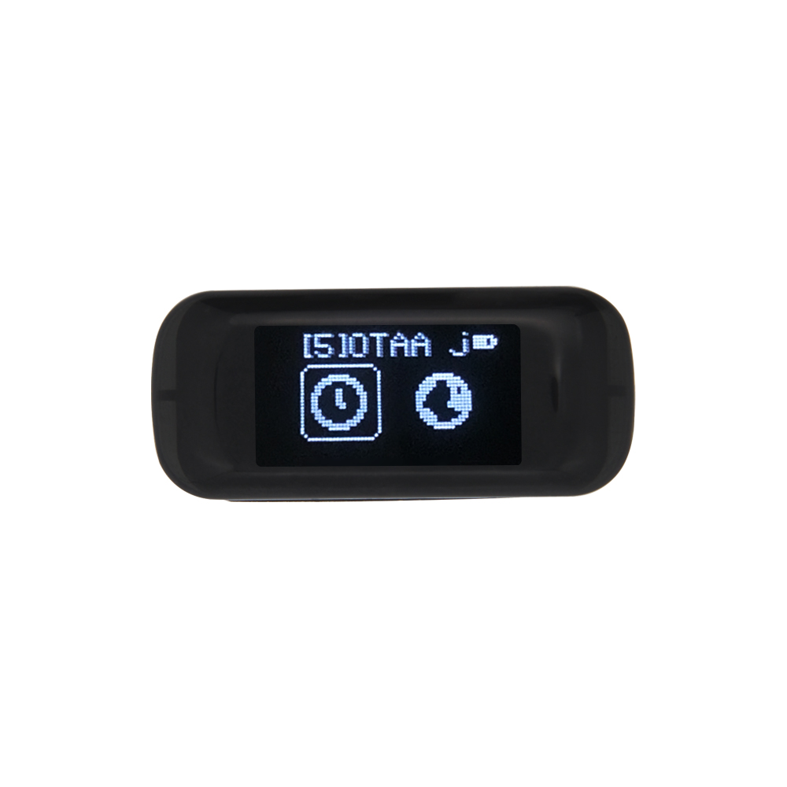
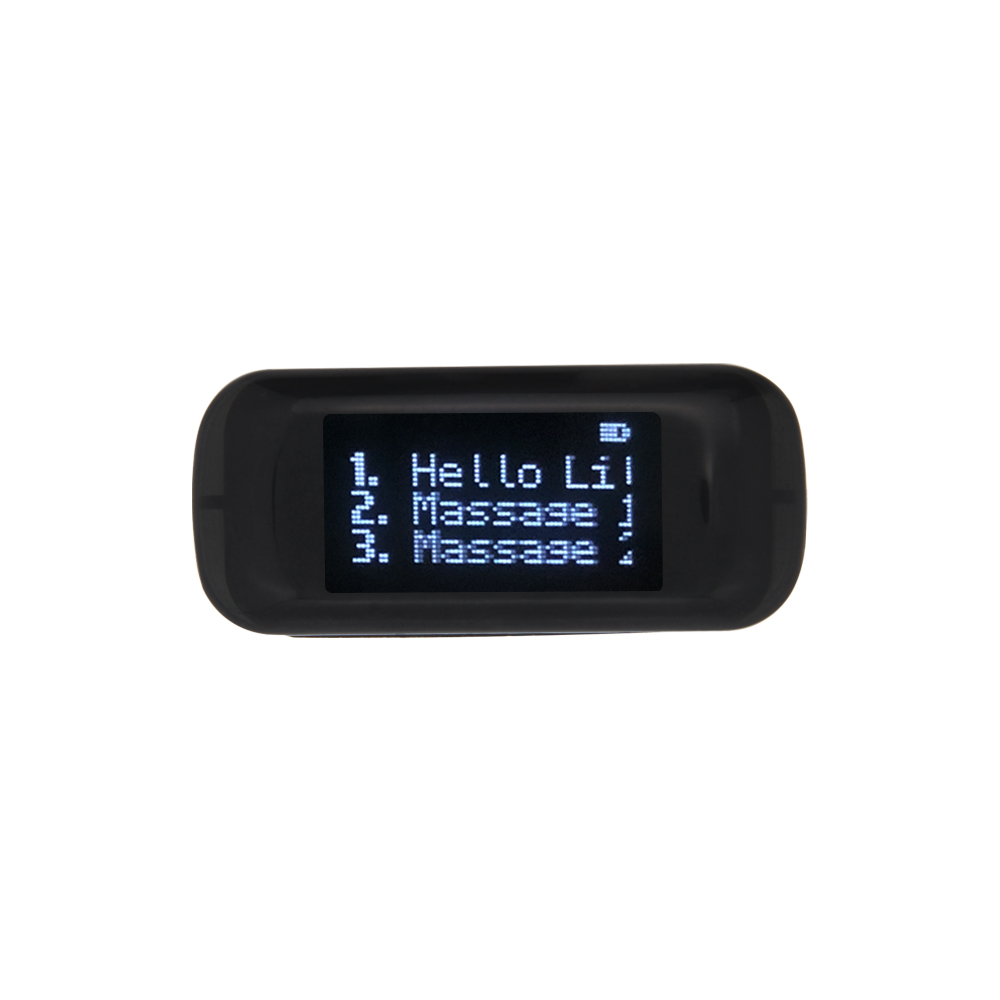
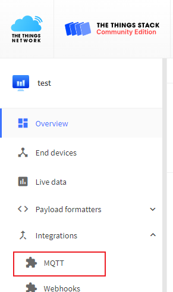
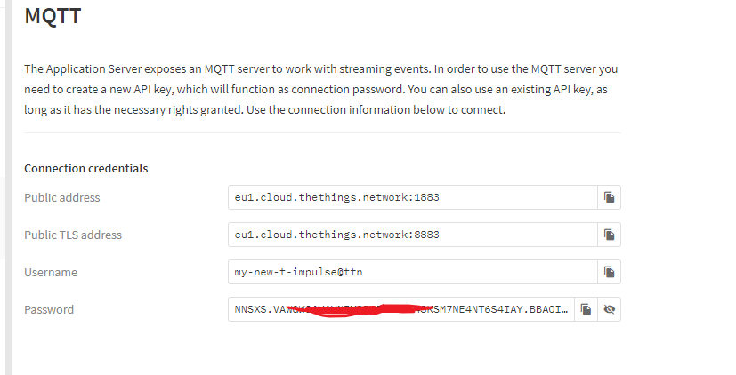
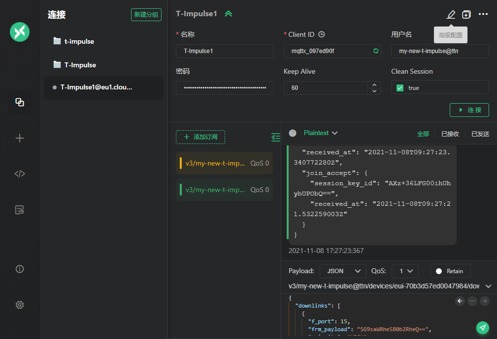

# T-Impulse Demo

## 1. Routine show
### Introduction:
- The top sliding text is the notification bar, which will be displayed when lorawan successfully connects to the network or receives data.
- The device contains a menu selection interface. 
- Click on the side of the screen to switch APP. 
- Double click to view APP content. Long press to exit the current APP.
-  If you are on the menu page at this time, press and hold to enter the sleep mode. When in the APP, single-click and double-click will become the control function in the APP. 
- For example: single-click to switch options, double-click to modify settings, etc.



## 2. `LoRaWAN` & `Cayenne` Settings
-  Refer to [SetLoRaWAN.md](/SetLoRaWan.md) settings

## 3. MQTT Settings
### Need to prepare
1. Have followed the above tutorial to connect to the TTN server.
2. A software or other device that can receive MQTT information.
- The `MQTT X` software used in this tutorial

- Open the TTN cloud and click on the MQTT function.


- Record all the information in MQTT. Note that once the page is refreshed, the password cannot be retrieved.

- Open the MQTT X software and set it according to the information above.

- According to the [TTN document](https://www.thethingsindustries.com/docs/integrations/mqtt/), subscribe to the information you need.

- If you want to send the information, you can use the following JSON format,The content of the `frm_payload` field will be decoded by `base64` and displayed in the message APP queue.<br>
Topic : `v3/{application id}@{tenant id}/devices/{device id}/down/push`
```json
{
  "downlinks": [{
    "f_port": 15,
    "frm_payload": "vu8=",
    "priority": "NORMAL"
  }]
}
```

- After completing the above steps, you can try to send simple sentences to the bracelet, remember that you need to perform `base64` conversion.


