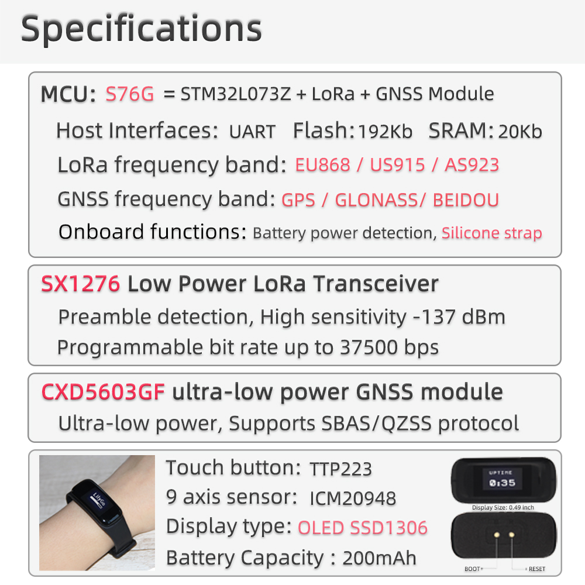
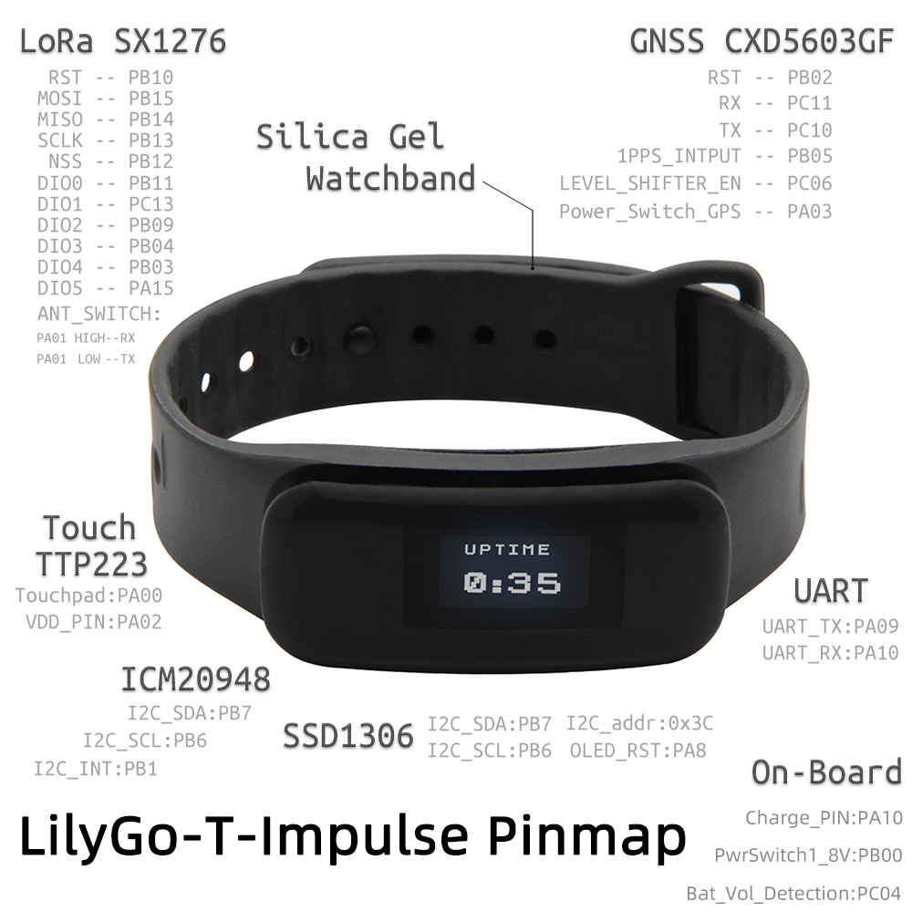
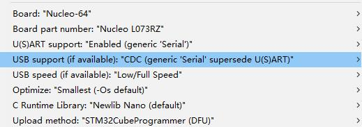
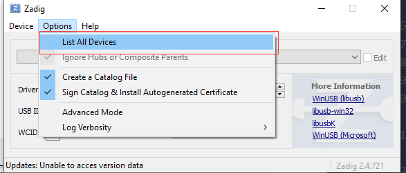
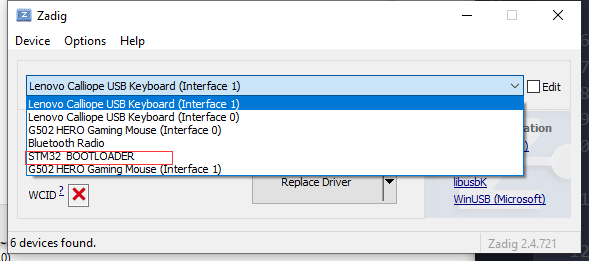
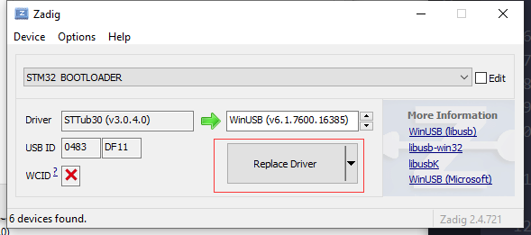
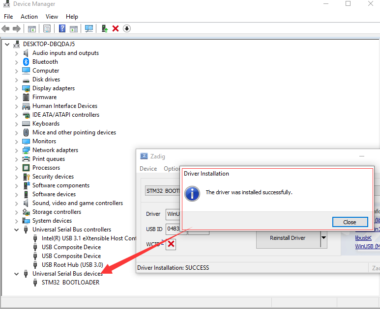
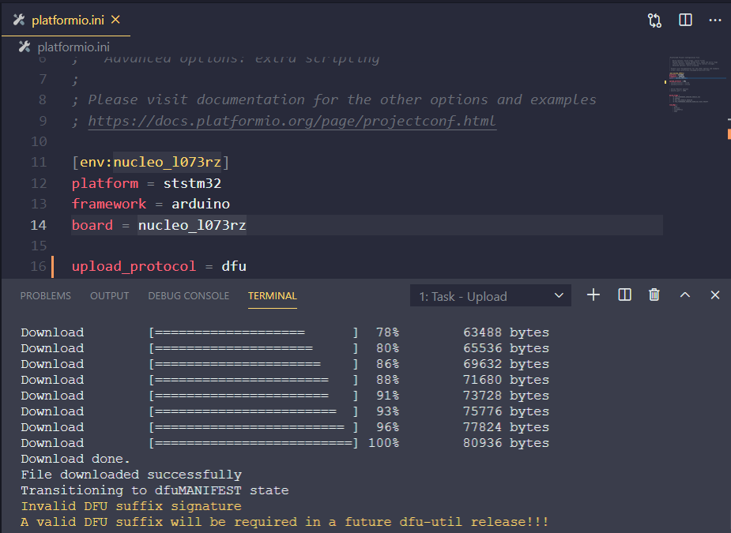
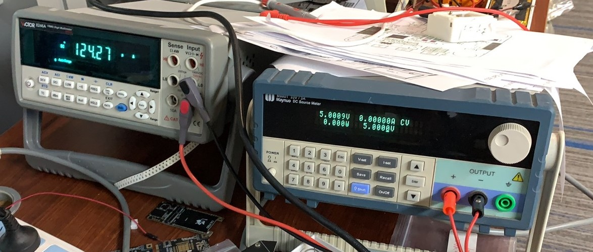

<h1 align = "center">🌟LilyGo T-Impulse🌟</h1>

## Using Arduino IDE
1. Download [Arduino IDE](https://www.arduino.cc/en/software)
2. Open Arduino, open preferences-> add https://github.com/stm32duino/BoardManagerFiles/raw/master/package_stmicroelectronics_index.json to the board installation manager address list
3. Open the board installation manager, wait for the index update to complete, select 'STM32 MCU based boards' and click install
4. After the installation is complete, select 'Necleo-64' in the board list.Detailed configuration reference Q&A

5. Copy all the folders in the lib directory to `"C:\User\<YourName>\Documents\Arduino\libraries"`

## USE PlatformIO

1. Install[VSCODE](https://code.visualstudio.com/)and[Python](https://www.python.org/)
2. Search for the PlatformIO plug-in in the VSCODE extension and install it.
3. After the installation is complete and the reload is completed, there will be a small house icon in the lower left corner. Click to display the Platformio IDE home page
4. Go to file - > Open folder - > Select the LilyGO-T-Impulse folder and click the (√) symbol in the lower left corner to compile (→) for upload.

<h3 align = "left">Product 📷:</h3>

|  Product   |                                                                                                Product  Link                                                                                                 |
| :--------: | :----------------------------------------------------------------------------------------------------------------------------------------------------------------------------------------------------------: |
| T-Impulse | [Taobao](https://item.taobao.com/item.htm?spm=a2oq0.12575281.0.0.50111debkzn8YY&ft=t&id=655131792555)   [AliExpress](https://www.aliexpress.com/item/1005003308747726.html)   |

<h3 align = "left">Application :</h3>

- [T-Impulse SoftRF](https://github.com/lyusupov/SoftRF/wiki/Bracelet-Edition)

<h3 align = "left">Introduce :</h3>

<h3 align = "left">PinOut :</h3>

## Q&A
##
### 1. Arduino IDE user prerequisites 
- Please follow this guide [Getting-started](https://github.com/stm32duino/Arduino_Core_STM32#getting-started) to complete the installation of `Arduino_Core_STM32` 
- Select the following picture in Arduino=> tools
    
- Copy all folders in the `libdeps` directory to the `~/Arduino/libraries` directory, and put them in `"Documents/Arduino/libraries"` for Windons users

### 2. How to upload the program to the board? 
- Before writing, press and hold the BOOT button on the board, then insert the USB, and then click upload 
- After writing, you need to unplug it again, and then plug it in again, select the port and open the serial port to view the output information

### 3. Why can't it be positioned? 
- Please ensure that the board and antenna are connected reliably, and the positioning area is outdoors, please do not perform positioning indoors 

### 4. My computer cannot recognize the port of the board ?

- Open the device manager, as shown in the figure, you will find `STM Device in DFU Mode`. At this time, the firmware cannot be uploaded. You need to use [zadig](https://zadig.akeo.ie/) to replace the original driver. The operation steps are as follows 
    
- Choose `STM32 BOOLTOADER`
    
- Click Replace Driver
    
    
- Click upload again. 
    

### 5. What is the lowest sleep power consumption current ?

- When using the SoftRF firmware test, the lowest power consumption during sleep is about 124uA

