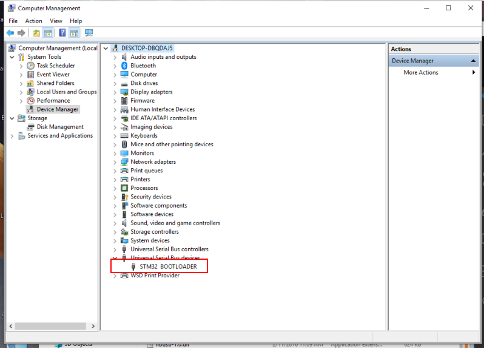
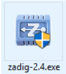
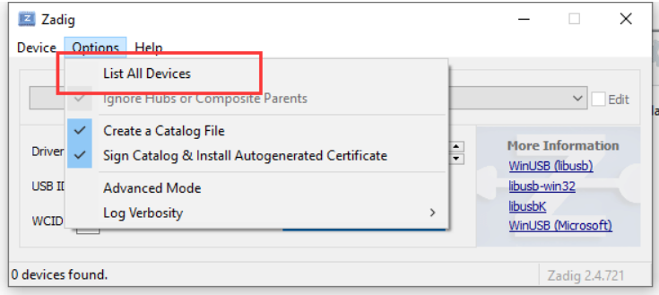
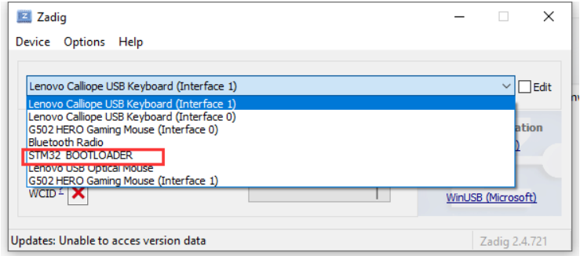
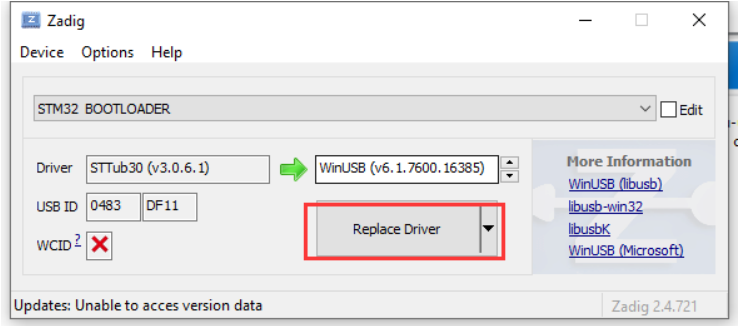
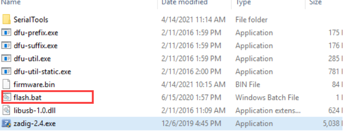
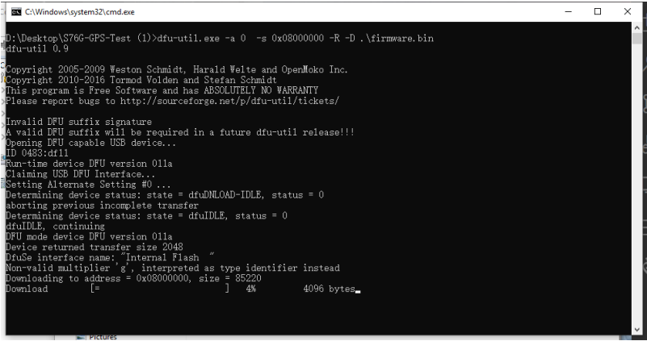

# 程序烧写及驱动安装

## 1. 驱动的安装和识别

1. 按住板⼦boot按键，然后插入到USB，设备管理器的`通⽤串⾏总线设备`应该显⽰如下图

    

2. 如果没有显⽰在通⽤串⾏总线设备⼀栏⽽显⽰在 `通⽤总线控制器` ⼀栏那么需要重新更新驱动才⾏，步骤如下：

    * 打开 `Zadig`，按照下图操作

        

        

        

        

    * 点击替换之后应该在 `通⽤串⾏总线设备` ⼀栏，到此驱动就更新完成，在后续不断的插入新的板⼦时，有时候会掉驱动，要按照上⾯⽅法重新替换⼀下驱动即可

3. 点击 `flash.bat` 进⾏程序的烧写，这时候等待烧写完成，如果进度条卡住了，那么按下键盘回⻋就能恢复了

    

    

4. 要烧写下⼀个板⼦，那么不需要重新打开`flash.bat`，只需要重新在串⼝按下回⻋键即可烧写下⼀个板⼦，记住烧写板⼦要按住boot按键

## 2.更换固件

1. 固件在文件夹内的文件名称为 `firmware.bin`，如果要替换固件，那么只需要将新的固件重命名为 `firmware.bin` 替换掉文件夹内的文件即可
